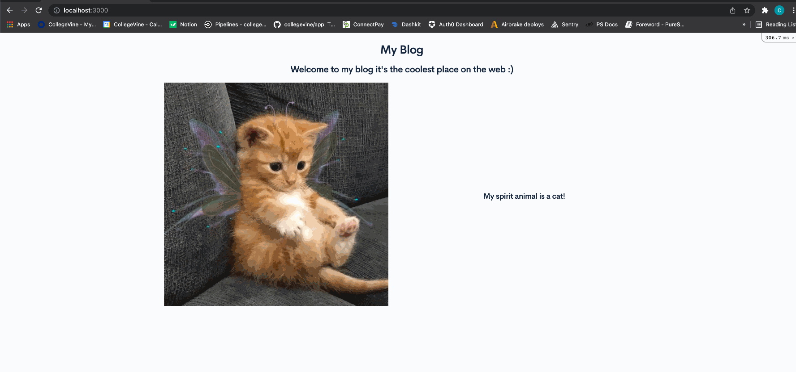

# Building a landing page

Landing pages are static pages that entice someone to use your application.
Launchpad is a codelab, so let's not get too carried away.
For this first portion of the exercise, try putting your own spin on the following:

1. Create a root page at `/` that displays a title for your new blog
2. Add a nice welcome message
3. People like pictures, so let them have a pretty image between the title and the message
4. Serve the image from launchpad

### Styling your landing page

In most cases, a page cannot exist without some degree of styling.
On top of aesthetic, we need to ensure a page is presented as expected across different aspect ratios.
For this second portion of the exercise, try the following:

1. Center the title of your blog, and make the welcome message a sub-header (also centered).
2. Create two columns of content that extends across your screen. 
The first column should contain the pretty image from the first part of the exercise, and the second column should contain a fun fact about yourself.
3. For mobile devices, ensure the first column is extended across the screen and the second column extends the screen below the first.

Example:

### Getting help
Take the next 30 minutes and read through the [Rails quickstart](https://guides.rubyonrails.org/getting_started.html) if you're unfamiliar with Rails.
For the second part, take some time to delve into Bootstrap's [grid system](https://getbootstrap.com/docs/5.1/layout/grid/).

Alright, done?
Now, if you have any questions, please go to your onboarding buddy first, or ask a question in #product-dev.

Also, use Google or DDG (DuckDuckGo) to get a quick sense for any terms or phrases that you're unfamiliar with.

#### Resources
1. [Rails routing](https://guides.rubyonrails.org/routing.html) Routing and controllers are an essential part of Rails, so take a moment to familiarize yourself if MVC frameworks are new to you or you haven't worked with Rails before.
2. [Rails controllers](https://guides.rubyonrails.org/action_controller_overview.html) Controllers are the C in MVC and are responsible for, well, controlling the effects of every single request to your server.
3. [Rails views](https://guides.rubyonrails.org/action_view_overview.html) Once you understand how to get a request to some Ruby code you've written, take a look into wiring a view onto that controller.
4. [Haml](https://haml.info/) is the flavor of markup we use for creating server-side rendered pages. It is less verbose than the standard ERB templating language in Rails, at the cost of looking less like HTML. However, it still does a good job of conveying a document's element hierarchy.
5. [Bootstrap](https://getbootstrap.com/) is a free and open-source CSS framework we use directed at responsive, mobile-first front-end web development.

#### Quick Review
- You learned...
    - How to set up a route in the `routes.rb` file
    - The "V" and "C" in the MVC lifecycle
        - The Controller handles application logic and dictates what should be passed into the view.
        - The View handles the presentation logic and can utilize variables/objects passed from the Controller.
    - Bootstrap's grid system and accounting for various screen sizes
    - HAML syntax